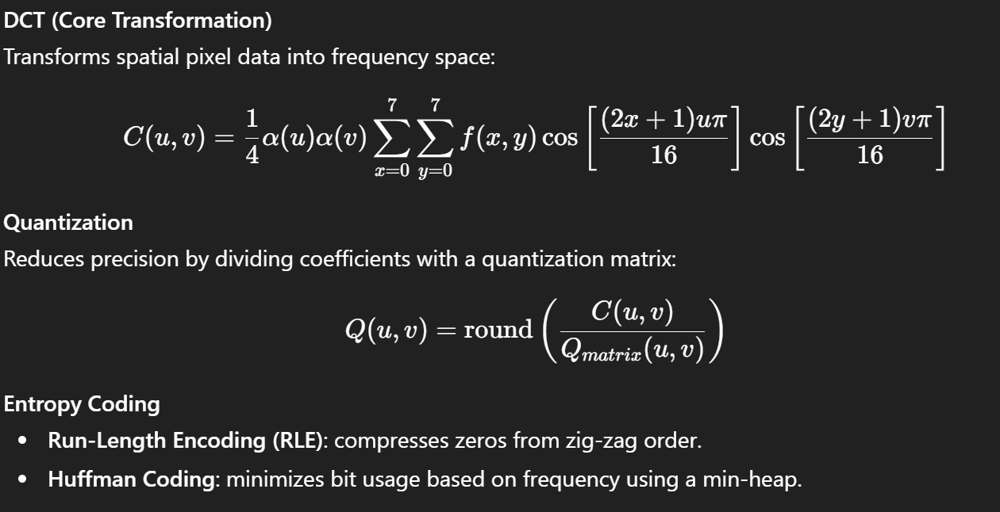
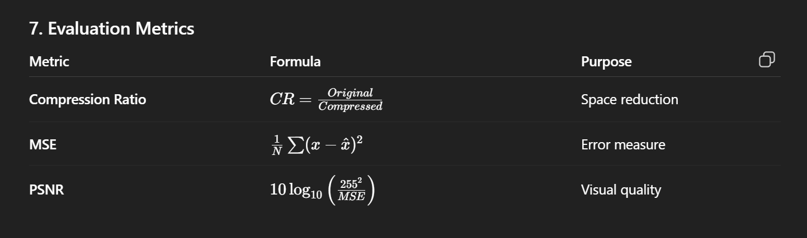

# 🧮 **Lossy Image Compression using Mathematics & DSA**

### **1. Problem Statement**

PNG images, though lossless, often store redundant information and occupy excessive storage.
This project aims to develop a **custom lossy image compression system** that leverages **mathematical transforms (DCT)** and **data structures (Huffman tree, RLE arrays)** to achieve high compression ratios with minimal perceptual quality loss.

---

### **2. Objective**

* Design a compression model grounded in math and algorithms.
* Implement transform-based encoding (DCT + Quantization).
* Use DSA-driven entropy coding (Heap-based Huffman).
* Evaluate performance via compression ratio and PSNR.

---

### **3. Core Concept**

Compression is achieved by **transforming** pixel data into a frequency domain, **quantizing** coefficients, and **encoding** efficiently.

#### **Pipeline**

```
Input PNG
 → Color Space Conversion (RGB → YCbCr)
 → 8×8 Block Division
 → Discrete Cosine Transform (DCT)
 → Quantization (Loss Introduction)
 → Zig-Zag Scanning
 → Run-Length Encoding (RLE)
 → Huffman Coding (using Heap)
 → Compressed File (.mcmp)
```

Decompression reverses the same steps.

---

### **4. Mathematical Foundation**




#### **Entropy Coding**

* **Run-Length Encoding (RLE)**: compresses zeros from zig-zag order.
* **Huffman Coding**: minimizes bit usage based on frequency using a min-heap.

---

### **5. Data Structures Used**

| Component        | Data Structure         | Purpose                         |
| ---------------- | ---------------------- | ------------------------------- |
| Huffman Encoding | Min-Heap / Binary Tree | Build optimal prefix codes      |
| Pixel Blocks     | 2D Arrays              | Store 8×8 matrices              |
| Zig-Zag Map      | Static Array           | Deterministic coefficient order |
| Symbol Map       | Hash Map               | Frequency & code lookup         |

---

### **6. Algorithm Overview**

**Compression**

```pseudo
for each 8x8 block:
    dct = DCT(block)
    q = quantize(dct)
    zz = zigzag(q)
    rle = run_length(zz)
    encoded += rle
huffman_tree = build_huffman(encoded)
bitstream = huffman_encode(encoded, huffman_tree)
save(bitstream, huffman_tree)
```

**Decompression**

```pseudo
data = huffman_decode(bitstream, tree)
for each block_data:
    zz = run_length_decode(block_data)
    q = inverse_zigzag(zz)
    dct = dequantize(q)
    block = inverse_DCT(dct)
reconstruct_image(blocks)
```

---

### **7. Evaluation Metrics**


---

### **8. Implementation Summary**

| Layer          | Tool                    |
| -------------- | ----------------------- |
| Language       | Python                  |
| Libraries      | NumPy, Pillow, heapq    |
| Output         | `.mcmp` compressed file |
| GUI (optional) | Streamlit / Tkinter     |

---

### **9. Results (Example)**

| File       | Original | Compressed | Ratio | PSNR  |
| ---------- | -------- | ---------- | ----- | ----- |
| image1.png | 2.4 MB   | 210 KB     | 11.4× | 34 dB |

---

### **10. Conclusion**

This project successfully combines **mathematical modeling** (DCT, quantization, entropy) with **algorithmic design** (heaps, arrays, RLE) to create an efficient, educationally transparent image compression system.
It achieves significant storage reduction while retaining acceptable visual quality, demonstrating how **math + DSA** can solve real-world optimization problems.

